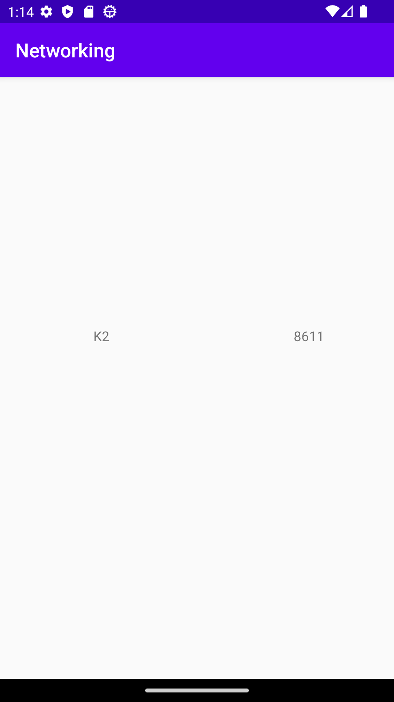

# Rapport
Jag använde mig av modifierade exempel från lenasys tillsammans med hjälp från både lärare och handledare
för att lösa denna uppggift. Jag började med att göra en ny recycler view i activity_main.xml. Denna recycler view fick sedan ett
ID som jag döpte till "MyRecyclerView". 
```
<androidx.recyclerview.widget.RecyclerView
        android:id="@+id/MyRecyclerView"
        android:layout_width="match_parent"
        android:layout_height="match_parent"
        app:layout_constraintBottom_toBottomOf="parent"
        app:layout_constraintEnd_toEndOf="parent"
        app:layout_constraintHorizontal_bias="0.498"
        app:layout_constraintStart_toStartOf="parent"
        app:layout_constraintTop_toTopOf="parent"
        app:layout_constraintVertical_bias="0.498" />
```
Sedan skapade jag de olika nya classer som skulle finnas med. 
En av dessa var "MyViewHolder" som användes för att hålla min view holder som tog emot datan som skulle
användas i min recycler view.
```
...
public MyViewHolder(@NonNull View itemView) {
        super(itemView);
        name = itemView.findViewById(R.id.name);
        size = itemView.findViewById(R.id.size);
    }
...
```
De andra classerna som skapades var "MyAdapter" och "Mountain"
MyAdapter kopplades ihop med MyViewHolder för att användas till att skapa en adapter för mina views 
för min recycler view.
```
...
public class MyAdapter extends RecyclerView.Adapter<MyViewHolder> {

    private List<Mountain> Mountain;
    public MyAdapter(List<Mountain> Mountain) {
        this.Mountain = Mountain;
    }
    @NonNull
    @Override
    public MyViewHolder onCreateViewHolder(@NonNull ViewGroup parent, int viewType) {
        View view = LayoutInflater.from(parent.getContext()).inflate(R.layout.item_mountain, parent, false);
        return new MyViewHolder(view);
    }
...
```
Mountains classen/filen användes för att definera de olika variablerna som de olika informationerna
om bergen skulle sparas i vilket var att namnen på bergen skulle sparas i variabeln "name"
och storleken på bergen skulle sparas i variabeln "size" Det är dessa variabler som sedan skrivs ut
i recycler viewn för att displaya de olika bergen och deras storlekar. 
```
...
public Mountain(String name, int size) {
        this.name = name;
        this.size = size;
    }
    public String getName() {

        return name;
    }
    public void setName(String name) {

        this.name = name;
    }
    public int getSize() {

        return size;
    }
...
```


